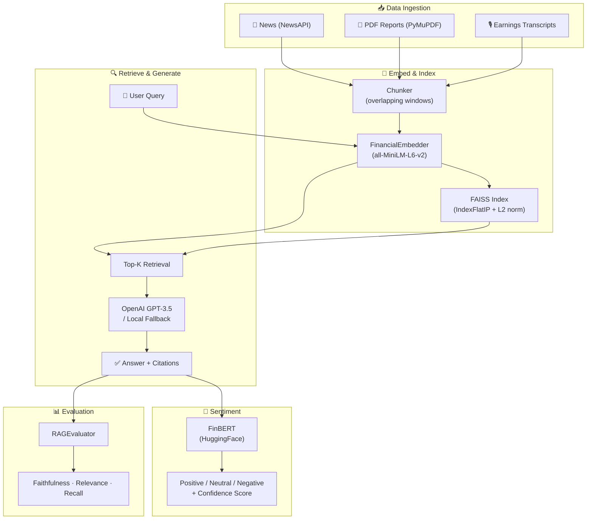
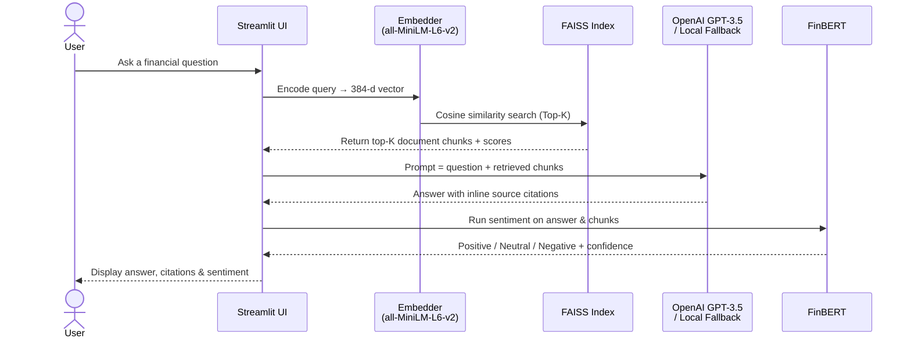
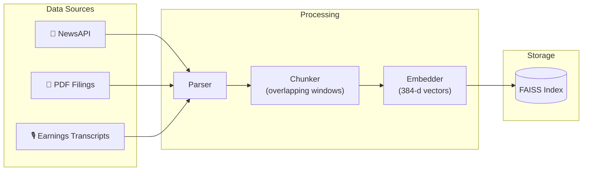

<div align="center">

# AI Financial Analyst

**A production-grade Retrieval-Augmented Generation (RAG) system for intelligent financial analysis**

[](https://python.org)
[](https://openai.com)
[](https://faiss.ai)
[](https://streamlit.io)
[](https://github.com/features/actions)
[](LICENSE)

[Features](#features) · [Architecture](#architecture) · [Quick Start](#quick-start) · [Evaluation](#evaluation-metrics) · [Tech Stack](#tech-stack)

</div>

---

## Overview

AI Financial Analyst ingests **earnings call transcripts**, **SEC filings**, and **real-time news** and lets you ask natural-language questions — returning **grounded, citation-backed answers** with **FinBERT sentiment analysis** in milliseconds.

Built on a battle-tested RAG pipeline, it combines semantic vector search (FAISS), domain-aware embeddings (sentence-transformers), and GPT-powered generation with a built-in evaluation framework to quantify retrieval and answer quality.

> **Works offline** — falls back to template-based generation and sample data when no API keys are configured.

---

## Features

| | Feature | Description |
|---|---|---|
| **Semantic Search** | FAISS Vector Index | Sub-millisecond cosine-similarity retrieval over thousands of document chunks |
| **Domain Intelligence** | FinBERT Sentiment | Financial-specific sentiment analysis — understands "beat estimates", "revenue miss", etc. |
| **Grounded Answers** | Citation-Backed RAG | Every answer references the exact source chunk it was generated from |
| **Multi-Source Ingestion** | News · PDFs · Transcripts | Pulls from NewsAPI, parses PDFs with PyMuPDF, and handles earnings call transcripts |
| **Built-in Evaluation** | RAG Metrics | Measures faithfulness, answer relevance, and context recall against a golden QA set |
| **Interactive UI** | Streamlit Dashboard | Clean web interface with query input, sentiment display, and source citations |
| **Offline Fallback** | Local LLM | Template-based generation when OpenAI API is unavailable |
| **CI/CD** | GitHub Actions | Automated test suite runs on every push |

---

## Architecture



---

## How It Works

### Query Flow



### Data Ingestion Flow



1. **Ingest** — Financial documents (news, earnings transcripts, PDF filings) are parsed and split into overlapping text chunks to preserve context across chunk boundaries.

2. **Embed** — Each chunk is encoded into a 384-dimensional vector using `all-MiniLM-L6-v2` from [sentence-transformers](https://www.sbert.net/), optimized for semantic similarity tasks.

3. **Index** — Vectors are stored in a FAISS `IndexFlatIP` index with L2 normalization, enabling exact cosine-similarity search at sub-millisecond latency.

4. **Retrieve** — The user question is embedded and the top-K most similar chunks are fetched from FAISS.

5. **Generate** — Retrieved context is injected into a structured prompt and sent to OpenAI GPT-3.5 (with a local template-based fallback when the API is unavailable). The model is instructed to cite its sources.

6. **Sentiment** — The answer and retrieved passages are run through FinBERT, a BERT model fine-tuned on financial corpora, to produce a sentiment label and confidence score.

7. **Evaluate** — A built-in evaluation framework scores **faithfulness** (is the answer grounded in context?), **answer relevance** (is it on-topic?), and **context recall** (did retrieval surface the right chunks?).

<details>
<summary><b>Why FAISS over a managed vector database?</b></summary>

For this project's scale (thousands of chunks), FAISS `IndexFlatIP` with normalized vectors delivers exact cosine similarity with sub-millisecond latency — no approximation, no network overhead, no cost. Swapping to Pinecone or Weaviate is trivial if scale demands it; a `PINECONE_API_KEY` slot is already wired into the config.

</details>

<details>
<summary><b>Why FinBERT over a general-purpose sentiment model?</b></summary>

General-purpose models perform poorly on financial language. Phrases like *"the company beat estimates"*, *"revenue miss"*, or *"soft guidance"* carry domain-specific sentiment that generic models misclassify. [FinBERT](https://arxiv.org/abs/1908.10063) is fine-tuned on financial news and achieves significantly higher accuracy on financial sentiment benchmarks.

</details>

---

## Quick Start

### Prerequisites

- Python 3.10+
- `pip`
- *(Optional)* OpenAI API key for GPT generation
- *(Optional)* NewsAPI key for real-time news

### Installation

```bash
# 1. Clone the repository
git clone https://github.com/your-username/ai-financial-analyst.git
cd ai-financial-analyst

# 2. Install dependencies
pip install -r requirements.txt

# 3. Configure environment variables
cp .env.example .env
#   → Edit .env and add your OPENAI_API_KEY
```

### Run

```bash
make run
# Opens the Streamlit dashboard at http://localhost:8501
```

### All Makefile Targets

| Command | Description |
|---|---|
| `make install` | Install all Python dependencies |
| `make run` | Launch the Streamlit web app |
| `make test` | Run the full pytest test suite |
| `make evaluate` | Run RAG evaluation on the golden QA set |

---

## Evaluation Metrics

The evaluation framework (`evaluation/rag_evaluator.py`) measures three dimensions of RAG quality over a 10-question golden QA set:

| Metric | What It Measures | How It's Computed |
|---|---|---|
| **Faithfulness** | Is the answer grounded in retrieved context? | Token overlap between answer and retrieved chunks |
| **Answer Relevance** | Is the answer on-topic with the question? | Cosine similarity between question and answer embeddings |
| **Context Recall** | Did retrieval surface the right chunks? | Keyword overlap between expected answer and retrieved chunks |

Run `make evaluate` to produce a report:

```
============================================================
  RAG Evaluation Results
============================================================
  Questions evaluated :  10
  Avg Faithfulness    :  0.2369
  Avg Answer Relevance:  0.5272
  Avg Context Recall  :  0.9255
============================================================
```

Results are saved as timestamped JSON files in `evaluation/results/` for tracking improvements over time.

---

## Project Structure

```
ai-financial-analyst/
│
├── data_ingestion/
│   ├── news_scraper.py              # NewsAPI integration & article fetching
│   ├── earnings_call_parser.py      # Earnings transcript parsing
│   └── reports_parser.py            # PDF parsing via PyMuPDF
│
├── embeddings/
│   └── embedder.py                  # sentence-transformers text encoder
│
├── retrieval/
│   ├── rag_pipeline.py              # FAISS index + OpenAI generation pipeline
│   └── local_llm.py                 # Template-based offline fallback LLM
│
├── sentiment/
│   └── sentiment_analyzer.py        # FinBERT-powered sentiment classification
│
├── evaluation/
│   ├── rag_evaluator.py             # Faithfulness / relevance / recall metrics
│   ├── golden_qa.json               # 10-pair golden QA set for benchmarking
│   └── results/                     # Timestamped evaluation output JSON files
│
├── ui/
│   └── streamlit_app.py             # Streamlit interactive web dashboard
│
├── tests/
│   ├── test_embedder.py             # Shape, normalization & similarity tests
│   ├── test_rag_pipeline.py         # Index construction & retrieval tests
│   └── test_sentiment.py            # Label validity & confidence range tests
│
├── .github/workflows/ci.yml         # GitHub Actions CI — runs on every push
├── config.py                        # Environment variable loader (python-dotenv)
├── .env.example                     # API key template
├── requirements.txt                 # Pinned Python dependencies
├── Makefile                         # Developer task shortcuts
└── README.md
```

---

## Tech Stack

| Layer | Technology | Purpose |
|---|---|---|
| **Embeddings** | `sentence-transformers` (`all-MiniLM-L6-v2`) | Encode text into 384-d semantic vectors |
| **Vector Search** | FAISS (`faiss-cpu`, `IndexFlatIP`) | Exact cosine-similarity retrieval |
| **LLM** | OpenAI GPT-3.5 · local fallback | Citation-backed answer generation |
| **Sentiment** | FinBERT (`transformers`) | Domain-specific financial sentiment |
| **Data Ingestion** | NewsAPI · PyMuPDF · BeautifulSoup | News, PDF, and transcript parsing |
| **Evaluation** | Custom `RAGEvaluator` | Faithfulness, relevance, recall scoring |
| **UI** | Streamlit | Interactive query & results dashboard |
| **CI/CD** | GitHub Actions + pytest | Automated tests on every commit |
| **Config** | `python-dotenv` | Secure API key management via `.env` |

---

## Configuration

Copy `.env.example` to `.env` and set your keys:

```bash
OPENAI_API_KEY=sk-...        # Required for GPT-powered generation
NEWS_API_KEY=...              # Optional — enables real-time news ingestion
PINECONE_API_KEY=...          # Optional — for managed vector DB (not used by default)
YAHOO_FINANCE_API=...         # Optional — for additional financial data
```

> All keys are optional. Without any keys, the system runs entirely offline using template-based generation and bundled sample data.

---

## Testing

```bash
# Run the full test suite
make test

# Run a specific test file with verbose output
pytest tests/test_embedder.py -v
pytest tests/test_rag_pipeline.py -v
pytest tests/test_sentiment.py -v
```

Test coverage includes:

- **Embedder** — Output shape validation, L2 normalization, semantic similarity ordering
- **RAG Pipeline** — FAISS index construction, top-K retrieval correctness, end-to-end query flow
- **Sentiment** — Valid label assertion, confidence range `[0, 1]`, probability sum validation

---

## References

- Lewis et al., *Retrieval-Augmented Generation for Knowledge-Intensive NLP Tasks* (2020) — [arXiv:2005.11401](https://arxiv.org/abs/2005.11401)
- Araci, *FinBERT: Financial Sentiment Analysis with Pre-Trained Language Models* (2019) — [arXiv:1908.10063](https://arxiv.org/abs/1908.10063)
- Johnson et al., *Billion-scale similarity search with GPUs* — FAISS (2019) — [arXiv:1702.08734](https://arxiv.org/abs/1702.08734)

---

## License

Distributed under the [MIT License](LICENSE).

---

<div align="center">

Built with Python · FAISS · OpenAI · FinBERT · Streamlit

</div>
